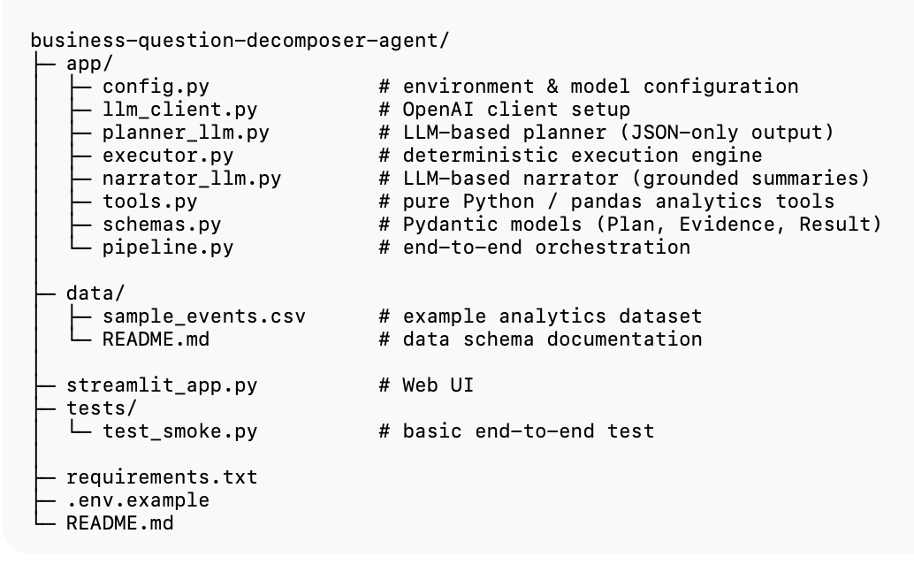
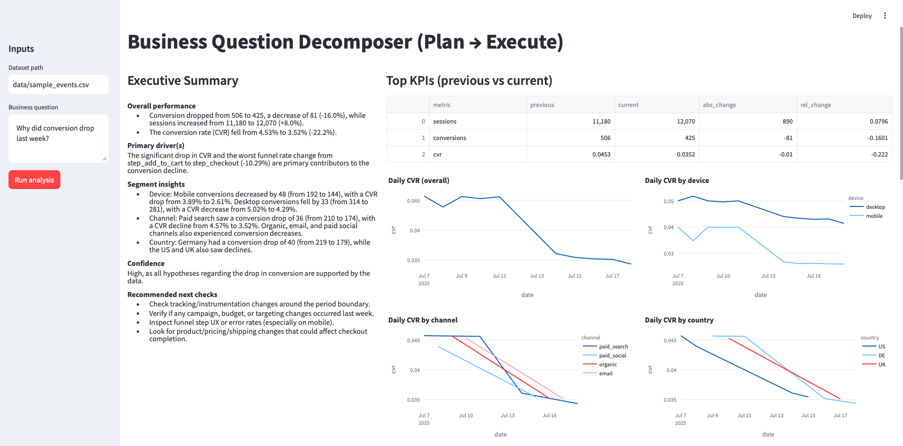

# Business Question Decomposer (Plan → Execute → Explain)

## Overview

This project is the second installment in the AgenticAI Evolution series.

- Project 1: focused on a fully deterministic pipeline for answering analytics questions.
- Project 2 (this repo): introduces LLMs as agents — specifically a Planner and a Narrator — while keeping execution and evidence strictly deterministic.

The goal is to combine the reasoning flexibility of LLMs with the reliability and auditability of classic analytics pipelines.

This project implements the P→t→E (plan‑then‑execute) concept:

1. **Plan (LLM)**
   - Interpret a vague business question
   - Propose hypotheses
   - Decide which metrics, segments, and checks are required
   - Output a strict, machine‑readable plan (JSON)

2. **Execute (Deterministic)**
   - Run only allow‑listed analytical tools
   - Compute KPIs, deltas, funnels, and segment impacts
   - Produce verifiable evidence (no hallucinations)

3. **Narrate (LLM)**
   - Convert structured evidence into a clear executive summary
   - Explain what changed, why it changed, and what to do next
   - Must quote evidence; never invent numbers

This separation ensures:
	-	transparency
	-	reproducibility
	-	business trust in AI-assisted analysis
  
## Project summary (what this app does)

This project answers business questions such as: “Why did conversion drop last week?”
The result is not just numbers, but actionable business insight.

### Applied example (CVR drop)

Using a sample e-commerce dataset, the system:
	-	Identifies a week-over-week drop in conversion rate (CVR)
	-	Separates traffic effects from conversion efficiency
	-	Detects a funnel issue between add-to-cart and checkout
	-	Shows how the drop differs by:
	-	device (mobile vs desktop)
	-	channel (paid search, organic, email, paid social)
	-	country (US, DE, UK)

### How P-t-E is applied here
**Planner (LLM)** — Generates hypotheses such as:

- traffic volume change
- CVR change
- funnel step degradation
- segment mix shift

**Executor (Python / pandas)** — Computes:

- KPI deltas (sessions, conversions, CVR)
- funnel conversion rates
- segment-level impacts

**Narrator (LLM)** — Produces a structured executive summary with:

- overall performance
- primary drivers
- segment insights
- confidence level
- recommended next checks

## Project Layout

  

## Use Case with Web UI (Streamlit)

  

## License
**MIT**
